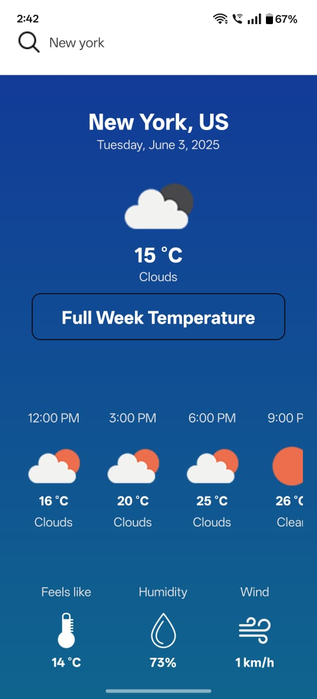

<h1 align="center">Wheater App</h1>

  
  &nbsp; &nbsp; &nbsp; &nbsp;
   
    &nbsp; &nbsp; &nbsp; &nbsp;
  
  &nbsp; &nbsp; &nbsp; &nbsp;
  

<h2 align="center">Consuming the OpenWeather api in the free version, I developed this app that shows information of the location you searched for. To be able to use the api it's necessary to create a .env file in the root directory and save the api key.
</h2>
<h3>
  📱 Android Preview (APK)

If you'd like to test the app on an Android device:

🔗 Download the APK here : https://expo.dev/accounts/suraj_0007/projects/weather-app/builds/3712d8f3-336e-4362-be55-49f7724e4b38

📝 Note: This APK is only available for Android. iOS builds require TestFlight or a registered Apple device and are not shared here.

</h3>
## ⚙️ Technologies

- [ ] Typescript
- [ ] React Js
- [ ] React Native
- [ ] Expo
- [ ] Openweather
- [ ] Axios

The app is designed to provide a clean and accessible weather interface with:
- Minimalistic bottom tab navigation for better discoverability
- Real-time feedback for search and loading states
- Simple but visually distinct current and forecast screens
- Responsive layout and theming that work across screen sizes

<h2>🛠️ Notes</h2>
Built using eas build for Android and iOS

iOS .ipa not included due to Apple provisioning restrictions

# Running React Native and Expo application

Install the Expo Go app on your iOS or Android phone and connect to the same wireless network as your computer. On Android, use the Expo Go app to scan the QR code from your terminal to open your project. On iOS, use the built-in QR code scanner of the default iOS Camera app.

### 'Clone the repository:'
git clone https://github.com/your-username/weather-app.git
cd weather-app

In the project directory, you just need to run:

### `npm install`

To install the node_modules and all dependeces.

### Add your .env file with the OpenWeather API key:
OPEN_WEATHER_API_KEY = your_api_key_here

### `npm start`

This will start a development server for you.
